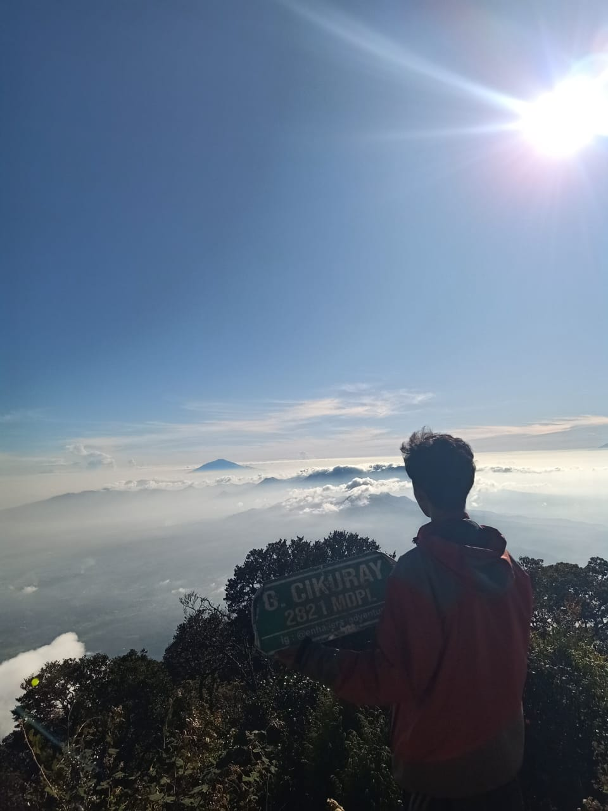
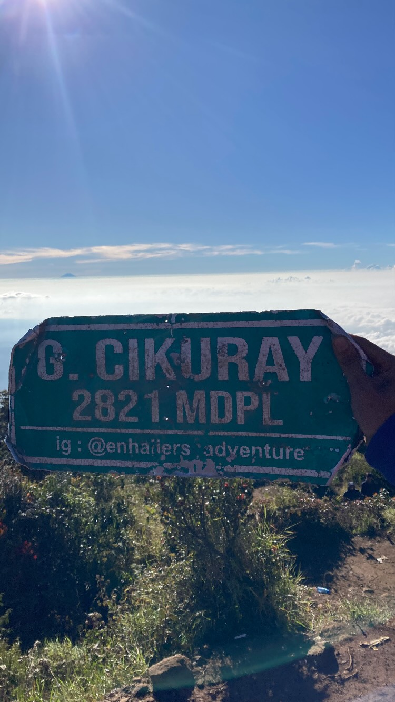
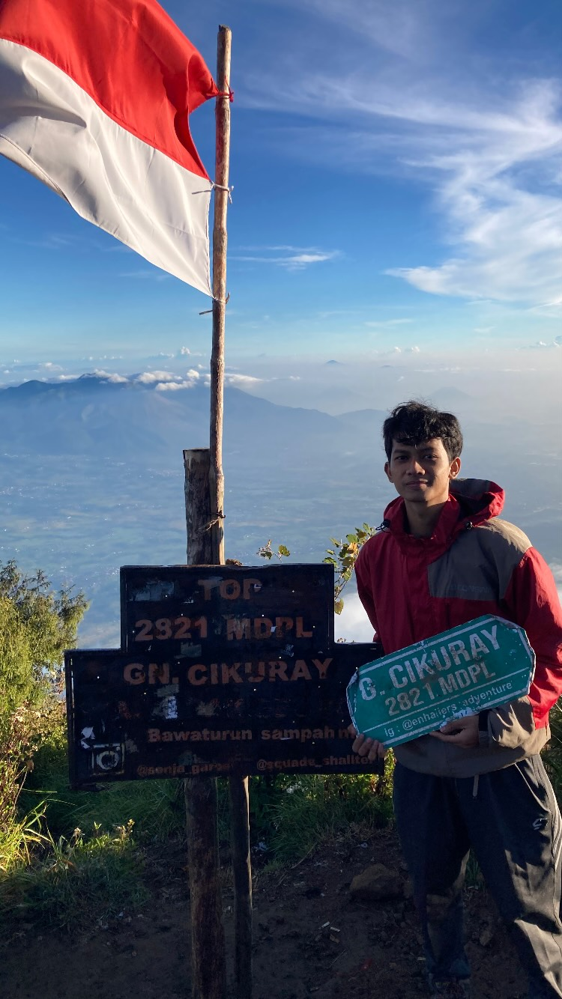
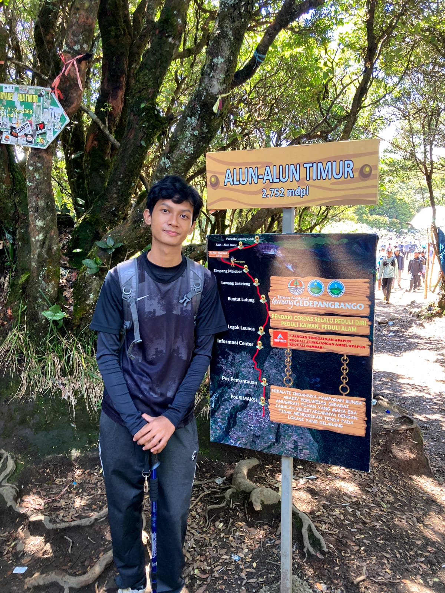
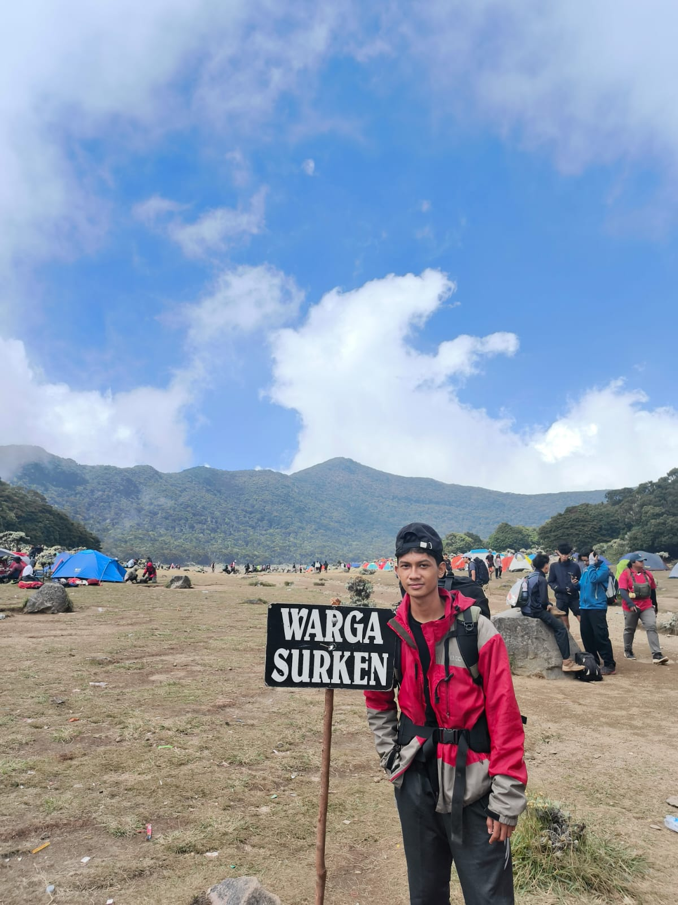

<!DOCTYPE html>
<html>
<head>
  <title>Blog Pribadi Nero</title>
</head>
<body>

  

    <h1><u><b>TUGAS PWD TEMA BLOG PRIBADI</b></u></h1>

      
    <h1>
<b><i>SELAMAT DATANG DI BLOG PRIBADI SAYA, SELAMAT MEMBACA!</i></b>
</h1>
  

  <!-- ini navbar -->
  

  

    <a href="#log">About me</a> |
    <a href="#cikuray">Perjalanan Gunung Cikuray</a> | 
    <a href="#gede">Perjalanan Gunung Gede</a> |
    <a href="#instagram">Instagram</a> |
    <a href="#form">Form Pendaftaran</a>
  

  

  <!-- ini tentang saya -->
  <h2 id="log"><b><u>About me</u></b></h2>
  
Hai, perkenalkan nama saya <b>Dhaffanero Habilqis Thorique</b>. Bisa dipanggil <b>Nero</b> atau <b>Dapner</b>. Saya saat ini berumur <b><u>20</u></b>tahun, saya lahir tepat di <b><i>Jakarta, 26 Juli 2005</i></b>. Saat ini saya sedang berkuliah di <b>Universitas Indraprasta PGRI Jakarta</b>, jurusan yang saya ambil yaitu <b><i><u>Teknik Informatika</u></i></b>. Hobi saya cukup banyak, salah satunya <b>mendaki</b>. Tanpa berlama-lama langsung aja, saya akan kasih tau petualangan mendaki saya ke <b><i>gunung Cikuray</i></b>dan <b><i>gunung Gede</i></b>. Let's goooo!. 
     Di sini saya nulis semua hal seru, terutama petualangan saya mendaki gunung di dua gunung tersebut. 
     Kalo kalian suka alam, kalian semoga bakal enjoy banget baca kisah di bawah ini.

    
  
<a href="#cikuray" style="color:blue;">Halaman selanjutnya → Perjalanan ke Gunung Cikuray</a>

  

              
  

<i>Thanks udah baca</i>

    
  

  <!-- Pendakian Gunung Cikuray -->
  <h2 id="cikuray"><b><u>About me - Pendakian ke Gunung Cikuray</u></b></h2>
  
<i>Gunung Cikuray</i> salah satu tempat paling berkesan buat saya. Saya berangkat dari <b><i>Jakarta</i></b> ke <b><i>Garut</i></b> bersama kedua teman saya menggunakan kendaraan pribadi yaitu motor, perjalanan memakan waktu kurang lebih 6 jam. Mulai berangkat dari jam 5 sore dan sampe jam 11 malam. Sesampainya di basecamp saya langsung makan dan beristirahat. Start pendakian sekitar jam 6 pagi, dan saya bersama teman saya langsung registrasi pendakian dan merapikan alat pendakian kembali sebelum naik. Saya naik melalui jalur <i>Cintanagara</i>. Oh iya, basecamp itu udah pos 1 ya. Dari pos 1 ke pos 2 estimasi 1 jam 30 menit. Sampai di pos 2, saya dan temen saya istirahat sejenak. Lalu setelah istirahat saya dan teman-teman melnajutkan pendakian menuju pos 3. Menuju pos 3 ini sangat lama lebih dari 4 jam, karena membawa perlengkapan yang cukup berat di cerrier. Sampai di pos 3 jam 1 siang dan beristirahat. Lanjut menuju pos 4, hanya memakan waktu 20 menit aja, sesampainya di pos 4, saya dan teman saya memutuskan untuk mendirikan tenda di pos 4 tersebut. 
     Setelah mendirikan tenda, saya dan teman saya masak dan makan sebelum beristirahat untuk summit. Setelah makan, saya istirahat dan bangun jam 3 pagi untuk summit. Dan jam 3 pun saya bangun dengan teman saya, dan langsung bersiap untuk summit. Dari pos 4 hingga pos 6 atau pos terakhir, trek nya sangat terjal, licin, akar, dan bebatuan. Setetlah melewati trek yang panjang, akhirnya saya sampai di puncak Cikuray jam 6 pagi. Dengan tinggi sekitar <b>2.821 mdpl</b>, pendakiannya cukup menantang tapi pemandangannya keren banget..

  
oh iya waktu itu saya k naik ke puncaknya cuman berdua yang satu gaikut muncak cuma mau tidur, dan di atas kita disambut <b>lautan awan paling indah</b> yang pernah saya liat. Sunrise nya ga dapet, tapi terliat dari jauh gunung <b><i>Papandayan</i></b>, <b><i>Guntur</i></b>, <b><i>Ciremai</i></b> bahkan gunung <b><i>Slamet</i></b> yang berada di <b>Jawa Tengah</b>. Saya dipuncak makan cuanki hangat sambil menikmati pemandangan keren. Setelah makan, saya foto-foto sampai jam 7 pagi. Setelah selesai berfoto, saya turn kembali sampai ke tenda saya. Sampai di tenda jam 9 pagi, lalu saya dan teman masak lagi dan makan lagi. Setelah makan selesai, jam 11 siang kita bereskan tenda untuk persiapan turun. Dah begini aja hehe.

  
<b>Foto saat di Gunung Cikuray:</b>

    

  
<b>Video di Cikuray:</b>

  <video width="400" controls>
    <source src="cikuray4.mp4" type="video/mp4">
  </video>

      
  
<a href="#gede" style="color:blue;">Halaman selanjutnya → Perjalanan ke Gunung Gede</a>

  
            
  

<i>Thanks udah baca</i>

   
  

  <!-- Lanjut Gunung Gede -->
  <h2 id="gede"><b><u>About - Perjalanan ke Gunung Gede</u></b></h2>
  
Gunung selanjutnya yang saya daki adalah <b><i>Gunung Gede</i></b>. Pendakian pertama saya ke gunung gede itu dengan 3 teman saya. beberapa hari seblum berangkat saya dan teman-teman mempersiapkan alat untuk mendaki dan juga menyiapkan logistik yang cukup. Saya berangkat hari jumat jam 4 sore, kali ini mengunakan kereta. Saya dan teman teman diantar ke stasiun oleh teman saya juga. Waktu nunggu kereta itu rame banget karena bareng orang pulang kerja. Orang pulang kerja, kita naik gunung. Saya cukup lama menunggukereta yang muat untuk kita berempat, lalu akhirnya saya dan teman saya memutuskan untuk dibagi 2 orang. 2 orang teman saya berangkat duluan, dan saya dengan satu teman menunggu kereta yang lain. Setelah dapat kereta, saya langsung bergegas dan menunggu hingga sampai stasiun bogor. Sesampainya di stasiun bogor saya dan teman saya sudah berkumpul kembali dan hujan deras, akhirnya menunggu hujan reda. Setelah reda, kita berempat langsung memesan grab mobil, sangat susah untuk mendapatkan grab karena saya dan teman saya membawa cerrier yang lumayan besar. 2 jam kemudian akhirnya dapet grab yang mau menerima orderan dari saya berempat. Lalu saya dan teman menuju basecamp, memakan waktu hampir 3 jam. Sesampainya di basecamp jam 12 an malam dan sudah jelas saya makan bersama teman saya dan packing ulang di basecamp. Setelah makan saya istirahat karena akan memulai pendakian jam 6 pagi. Oh iya, pendakian saya ini lewat jalur <b><i>Putri</b></i>. Tibalah jam 6 pagi dan saya mulai mendaki. Basecamp ke pos 1 lumayan jauh namun treknya masih landai kurang lebih 40 menitan. Lanjut ke pos 2 ngga terlalu lama tapi saya dan teman beristirahat dulu sejenak, karena pos 2 ke pos 3 sangat jauh. Setelah istirahat, saya dan teman lanjut menuju pos 3, memakan waktu 2 jam. Di pos 3 saya dan teman berisitirahat lumayan lama dan tertidur sejenak kurang lebih 1 jam. Lalu lanjut ke pos 4, disini trek nya sudah mulai nanjak karena akar semua dan bikin cape, kita brempat lebih sering istirahat di trek menuju pos 4 ini. Karena sering istirahat, sampai di pos terakhir jam 1 siang, itu udah lega banget karena udah pos terakhir. Lalu saya menuju ke <i>savana</i> dan membuat dokumentasi. Lalu setelah selesai dokumentasi, saya dan teman langsung mencari spot tenda. Setelah dapet spot, langsung mendirikan tenda, makan, dan istirahat.
     Perjalanannya beda banget dari Cikuray lebih adem dan dingin. Oh iya, saya dan teman saya ga berencana untuk menuju puncak hanya sampai <bSurya Kencana<b>. Surya Kencana tuh savana luas yang ada di gunung gede dan itu adalah camp area juga. Gunung ini juga salah satu gunung favorit dan teramai untuk didaki. Udah kaya pasar pokomya, warung banyak banget. Alasan saya ga menuju puncak karena sangat rameee. Dah segini aja.

  
  
<b>Foto saat di Gunung Gede:</b>

   

  
<b>Video Gede:</b>

  <video width="400" controls>
    <source src="gede2.mp4" type="video/mp4"> 
  </video>

  <video width="400" controls>
    <source src="gede3.mp4" type="video/mp4">
  </video>

         
  
<a href="#instagram" style="color:blue;">Halaman selanjutnya → Instagram</a>

              
  

<i>Thanks udah baca</i>

      
    

  <!-- Bagian Instagram -->
  <h2 id="instagram"><b><u>About - Instagram</u></b></h2>
  
Buat yang <i>penasaran</i> sama ig saya, bisa langsung mamir Instagram ya. Ga diprivate kok, liat highlight aja banyak perjalanan ke gunung WKWKWKW. Follow juga dong yang belom, makasiihhh. 😎👇

  
<a href="https://www.instagram.com/dapnerrrr?igsh=OHdudGdnd3M5cGtq" target="_blank" style="color:blue;">Klik di sini buat ke Instagram gue</a>

        
  
<a href="#form" style="color:blue;">Halaman selanjutnya → Form Pendaftaran</a>

  
              
  

<i>Thanks ya udah follow</i>

      
   

  <!-- ====== FORM P7 ====== -->

  <form>
    <table width="80%" border="0" cellspacing="8">
      <tr>
        <td colspan="2" align="center"><h3><u><b>APPLICATION FORM</b></u></h3></td>
      </tr>

      <!-- Personal Details -->
      <tr>
        <td colspan="2">
          <fieldset>
            <legend><b>Personal Details</b></legend>
            <table cellspacing="5">
              <tr>
                <td>Applicant’s full name:</td>
                <td>
                  <select>
                    <option>-Select-</option>
                    <option>Mr.</option>
                    <option>Ms.</option>
                    <option>Mrs.</option>
                  </select>
                  <input type="text" size="25">
                </td>
                <td>Care Of:</td>
                <td>
                  <input type="radio" name="care" checked> Parents
                  <input type="radio" name="care"> Guardian
                </td>
              </tr>

              <tr>
                <td>Father’s Name:</td>
                <td>Mr. <input type="text" size="20"></td>
                <td>Mother’s Name:</td>
                <td>Mrs. <input type="text" size="20"></td>
              </tr>

              <tr>
                <td>Gender:</td>
                <td>
                  <input type="radio" name="gender"> Male
                  <input type="radio" name="gender"> Female
                  <input type="radio" name="gender"> Others
                </td>
                <td>Date of Birth:</td>
                <td><input type="date"></td>
              </tr>

              <tr>
                <td>Marital Status:</td>
                <td>
                  <select>
                    <option>-Select-</option>
                    <option>Single</option>
                    <option>Married</option>
                  </select>
                </td>
                <td>Category:</td>
                <td>
                  <select>
                    <option>-Select-</option>
                    <option>General</option>
                    <option>OBC</option>
                    <option>SC</option>
                    <option>ST</option>
                  </select>
                </td>
              </tr>

              <tr>
                <td>Handicapped:</td>
                <td>
                  <input type="radio" name="hand"> No
                  <input type="radio" name="hand"> Yes
                </td>
                <td>Ex-Serviceman:</td>
                <td>
                  <input type="radio" name="ex"> No
                  <input type="radio" name="ex"> Yes
                </td>
              </tr>

              <tr>
                <td>EWS:</td>
                <td>
                  <input type="radio" name="ews"> No
                  <input type="radio" name="ews"> Yes
                </td>
                <td>Religion:</td>
                <td>
                  <select>
                    <option>-Select-</option>
                    <option>Islam</option>
                    <option>Christian</option>
                    <option>Hindu</option>
                    <option>Budha</option>
                  </select>
                </td>
              </tr>
            </table>
          </fieldset>
        </td>
      </tr>

      <!-- Contact Details -->
      <tr>
        <td colspan="2">
          <fieldset>
            <legend><b>Contact Details</b></legend>
            <table cellspacing="5">
              <tr>
                <td>Mobile Number:</td>
                <td><input type="text" size="20"></td>
                <td>Email ID:</td>
                <td><input type="email" size="25"></td>
              </tr>

              <tr>
                <td>Address Line 1:</td>
                <td colspan="3"><input type="text" size="60"></td>
              </tr>

              <tr>
                <td>Address Line 2:</td>
                <td colspan="3"><input type="text" size="60"></td>
              </tr>

              <tr>
                <td>City:</td>
                <td><input type="text" size="20"></td>
                <td>State:</td>
                <td>
                  <select>
                    <option>-Select-</option>
                    <option>Jawa Barat</option>
                    <option>Jawa Tengah</option>
                    <option>Jawa Timur</option>
                  </select>
                </td>
              </tr>

              <tr>
                <td>Pin Code:</td>
                <td><input type="text" size="10"></td>
              </tr>
            </table>
          </fieldset>
        </td>
      </tr>

      <!-- Qualification Details -->
      <tr>
        <td colspan="2">
          <fieldset>
            <legend><b>Qualification Details</b></legend>
            <table border="1" width="100%" cellspacing="0" cellpadding="5">
              <tr align="center">
                <th>Sr No.</th>
                <th>Qualification</th>
                <th>Board/University</th>
                <th>Passing Year</th>
                <th>Max Marks</th>
                <th>Marks Obtain</th>
                <th>Percentage</th>
              </tr>
              <tr align="center">
                <td>1</td>
                <td><select><option>-Select-</option></select></td>
                <td><input type="text" size="12"></td>
                <td><input type="text" size="8"></td>
                <td><input type="text" size="8"></td>
                <td><input type="text" size="8"></td>
                <td><input type="text" size="8"></td>
              </tr>
              <tr align="center">
                <td>2</td>
                <td><select><option>-Select-</option></select></td>
                <td><input type="text" size="12"></td>
                <td><input type="text" size="8"></td>
                <td><input type="text" size="8"></td>
                <td><input type="text" size="8"></td>
                <td><input type="text" size="8"></td>
              </tr>
              <tr align="center">
                <td>3</td>
                <td><select><option>-Select-</option></select></td>
                <td><input type="text" size="12"></td>
                <td><input type="text" size="8"></td>
                <td><input type="text" size="8"></td>
                <td><input type="text" size="8"></td>
                <td><input type="text" size="8"></td>
              </tr>
              <tr align="center">
                <td>4</td>
                <td><select><option>-Select-</option></select></td>
                <td><input type="text" size="12"></td>
                <td><input type="text" size="8"></td>
                <td><input type="text" size="8"></td>
                <td><input type="text" size="8"></td>
                <td><input type="text" size="8"></td>
              </tr>
            </table>
          </fieldset>
        </td>
      </tr>

      <!-- Language Knowledge -->
      <tr>
        <td colspan="2">
          <fieldset>
            <legend><b>Language Knowledge</b></legend>
            <table border="0" width="60%" cellspacing="5">
              <tr align="center">
                <th>Language</th><th>Reading</th><th>Writing</th><th>Spoken</th>
              </tr>
              <tr align="center"><td>Hindi</td><td><input type="checkbox"></td><td><input type="checkbox"></td><td><input type="checkbox"></td></tr>
              <tr align="center"><td>English</td><td><input type="checkbox"></td><td><input type="checkbox"></td><td><input type="checkbox"></td></tr>
              <tr align="center"><td>Urdu</td><td><input type="checkbox"></td><td><input type="checkbox"></td><td><input type="checkbox"></td></tr>
            </table>
          </fieldset>
        </td>
      </tr>

      <tr>
        <td colspan="2">
          <fieldset>
            <legend><b>Identification Details</b></legend>
            <table cellspacing="5">
              <tr>
                <td>Aadhar Card Number:</td>
                <td><input type="text" size="20"></td>
                <td>PAN Card Number:</td>
                <td><input type="text" size="20"></td>
              </tr>
              <tr>
                <td>Upload Photo:</td>
                <td><input type="file"></td>
                <td>Upload Signature:</td>
                <td><input type="file"></td>
              </tr>
              <tr align="center">
                <td colspan="4">
                   
                  <input type="submit" value="Submit">
                  &nbsp;&nbsp;
                  <input type="reset" value="Back">
                </td>
              </tr>
            </table>
          </fieldset>
        </td>
      </tr>
    </table>
  </form>

      
  
<i>form ini tugas P7</i>

  

  
</body>
</html>
